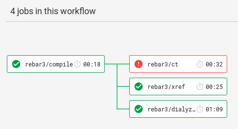
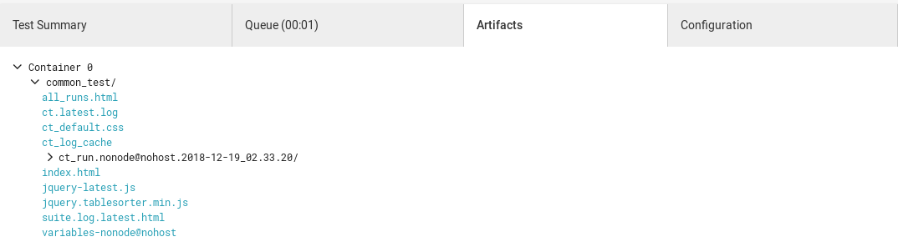

# Rebar3 Orb for CircleCI

This [orb](https://circleci.com/orbs/) provides commands for running rebar3 tasks for compiling, analyzing (xref and dialyzer) and testing (common test) a project.

Be sure to include the `cth_surefire` common test hook in `rebar.config`. This hook will output the test results in a format (JUnit XML) understood by CircleCI so it can better display any failures and provide insights to your test runs:

``` erlang
{ct_opts, [{ct_hooks, [cth_surefire]}]}.
```

Example CircleCI config (`.circleci/config.yml`) for using this Orb:

``` yaml
version: 2.1

orbs:
    rebar3: tsloughter/rebar3@0.5.3

workflows:
  build-test:
    jobs:
      - rebar3/compile
      - rebar3/xref:
          requires:
            - rebar3/compile
      - rebar3/dialyzer:
          requires:
            - rebar3/compile
      - rebar3/ct:
          requires:
            - rebar3/compile
```

The workflow when run by CircleCI:



Common Test artifacts that get stored for viewing after a run:




